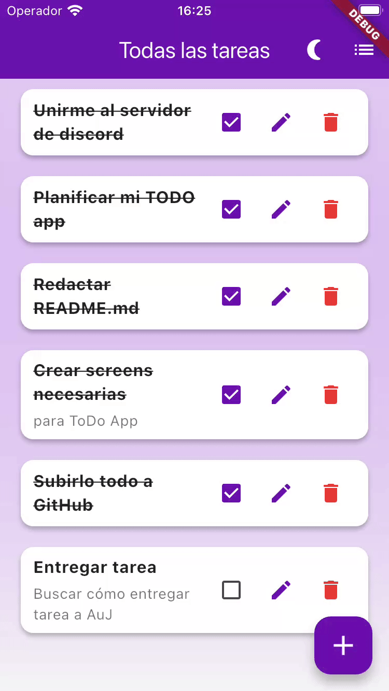
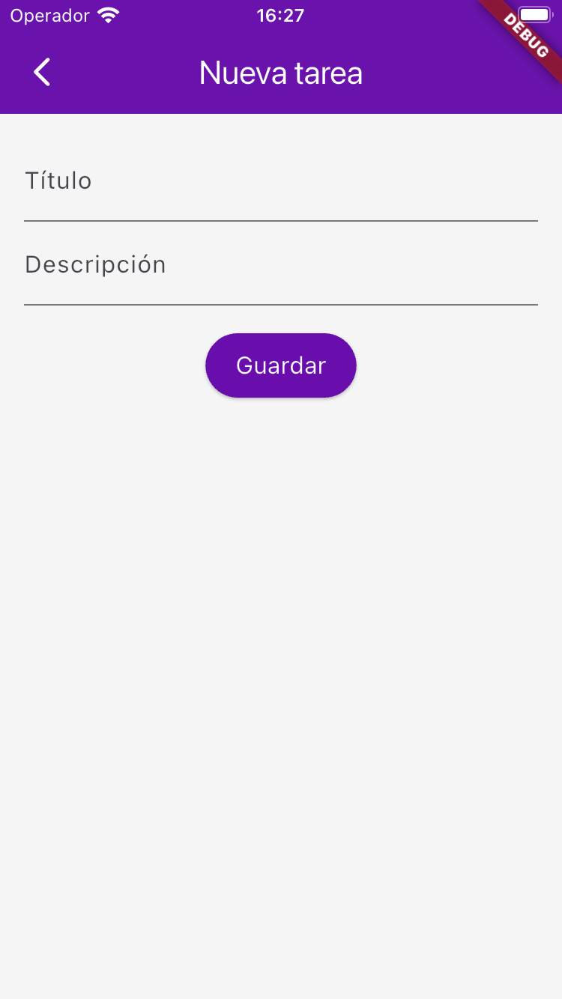
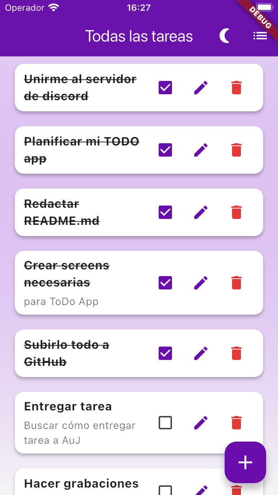
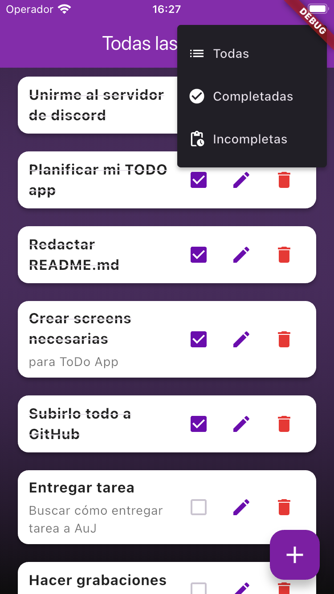
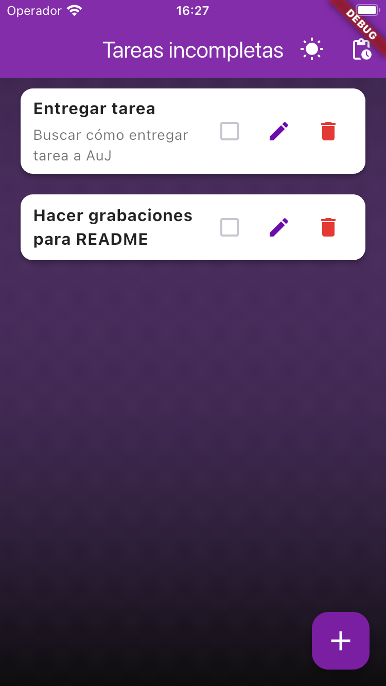

# Reto Mobile – ToDo App

## Objetivo
Crear una app móvil sencilla de lista de tareas en Flutter, cumpliendo los requisitos del reto previo de Adopta un Junior.

## Requisitos implementados
- Pantalla de lista de tareas (ToDo)
- Añadir nueva tarea (título + descripción)
- Mostrar tareas en una lista
- Marcar tareas como completadas

## Extras implementados
- Persistencia local usando `SharedPreferences`
- Eliminar tareas con confirmación
- Añadir filtro de tareas 
- Añadir edición de tareas
- Diseño básico pero cuidado
- Añadir dark/light mode
- Añadir diálogo cuando la tarea está vacía o la descripción está vacía

## Plan de desarrollo paso a paso
1. Crear el modelo `Task` con título, descripción y estado de completada.
2. Pantalla principal (`HomeScreen`) con lista de tareas.
3. Función para añadir tareas mediante `AddTaskScreen`.
4. Marcar tareas como completadas desde la lista.
5. Persistencia local de tareas usando SharedPreferences.
6. Mejorar diseño y experiencia de usuario básica.
7. Añadir capturas o GIFs del funcionamiento para el README final.

## Estructura de la app

```bash
assets/
├─ screenshots/
│  ├─ add_task_light_mode.png
│  ├─ home_light_mode.png
│  ├─ home_dark_mode.png
│  └─ incompleted_tasks_dark_mode.png
└─ gifs/
   └─ demo_todo_app.gif
lib/
├─ main.dart
├─ models/
│  └─ task.dart
├─ screens/
│  ├─ home_screen.dart
│  └─ add_task_screen.dart
└─ widgets/
   └─ task_tile.dart
```
- `main.dart`: Entry point de la app, llama a `HomeScreen`

- `models/task.dart`: Modelo Task con título, descripción y estado `isDone`

- `screens/home_screen.dart`: Pantalla principal que muestra la lista de tareas y botón para añadir nuevas

- `screens/add_task_screen.dart`: Pantalla para añadir una nueva tarea

- `widgets/task_tile.dart`: Widget que representa cada tarea en la lista con título, descripción y checkbox

## Cómo ejecutar la app
1. Clonar el repositorio:
```bash
git clone https://github.com/violetacf/reto_auj_mobile.git
```

2. Entrar en la carpeta del proyecto: 
```bash
cd reto_auj_mobile
```

3. Instalar dependencies:
```bash
flutter pub get
```

4. Abrir el simulador:
```bash
open -a Simulator
```

5. Ver los dispositivos disponibles:
```bash
flutter devices
```

4. Ejecutar la app en el simulador:
```bash
flutter run -d <device_id_del_simulador>
```


## Capturas de pantalla y grabaciones de la App

### GIFs
<p align="center">
  
</p>
<sub>Demostración rápida de la app ToDo mostrando añadir, completar y filtrar tareas.</sub>

### Capturas de pantalla

#### Light Mode
<p align="center">
  
  
</p>
<sub>Pantalla añadir tarea y lista principal en Light Mode.</sub>

#### Dark Mode
<p align="center">
  
  
</p>
<sub>Lista principal y vista de tareas incompletas en Dark Mode.</sub>

